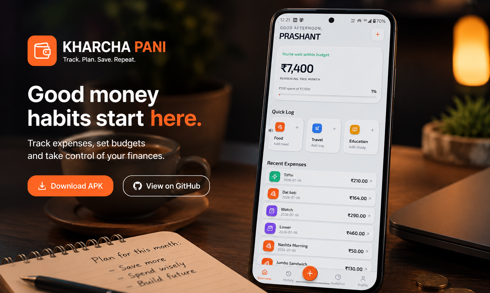

# 💸 Kharcha Pani — Personal Finance Application

> A production-style multi-user personal finance backend built with **Java, Spring Boot, Spring Security, JWT Authentication, JPA/Hibernate, MySQL, Docker, and REST APIs**, powering the **Kharcha Pani Android application**.


<table >
<tr>

<td>
    <p align="center">
  
</p>
<a href="https://github.com/PrashantOmBairagi/kharcha-pani/releases/latest">

 
</a>
       <--- Click to download !!
</td>
 
</tr>
</table>


---

## 📱 Kharcha Pani

Kharcha Pani is a personal finance platform designed around the way students and young professionals actually manage money.

The backend provides secure expense management, monthly financial tracking, authentication, authorization, pagination, validation, and user-specific data isolation through REST APIs.

The Android client consumes these APIs to provide expense tracking, budgeting, analytics, and account management.

---

## 📸 Application Screenshots

<p align="center">
  
  
  
  
  
</p>

---

# 📖 Overview

Smart Finance Tracker started as a simple expense-tracking API and evolved into a multi-user financial backend with authentication, authorization, relational domain modeling, pagination, monthly financial management, Dockerization, and cloud deployment.

The project was built to gain practical experience with real-world backend engineering concepts including:

* REST API design
* Authentication and authorization
* JWT-based security
* Relational database modeling
* JPA/Hibernate relationships
* DTO-based API design
* Validation
* Exception handling
* Pagination
* Docker containerization
* Cloud deployment
* User data isolation

The backend is currently deployed on **AWS EC2** with application networking configured for external API access.

---

# ✨ Features

## 🔐 Authentication & Security

* User Registration
* User Login
* BCrypt Password Hashing
* JWT Authentication
* Stateless Session Management
* Protected REST Endpoints
* JWT Filter-based Authentication
* User-Specific Data Access
* Unauthorized Access Protection
* Profile Completion Flow

---

## 👤 User Management

* User Registration
* Profile Creation
* Profile Completion Workflow
* Profile Retrieval
* Profile Updates
* Unique Email Validation
* Unique Phone Validation
* UUID-Based User Identification

---

## 💰 Expense Management

* Create Expenses
* View Expenses
* View Individual Expenses
* Update Expenses
* Delete Expenses
* Category-Based Tracking
* Date-Based Tracking
* Paginated Expense Retrieval
* Multi-User Support
* Expense Ownership Validation
* User-Specific Expense Isolation

---

## 📅 Financial Month Management

Kharcha Pani models financial data around individual financial months — each user can have multiple financial months, while each financial month contains multiple expenses.

```text
User
│
├── Financial Month — January 2026
│       ├── Expense
│       ├── Expense
│       └── Expense
│
├── Financial Month — February 2026
│       ├── Expense
│       └── Expense
│
└── Financial Month — March 2026
        ├── Expense
        ├── Expense
        └── Expense
```

A financial month contains:

* Year, Month
* Monthly Budget
* Planned Monthly Income
* Aggregated Expenses (server-side)

**Implemented features:**

* **Auto-create on first expense** — if a financial month doesn't exist for the expense's month, it's created with the previous month's budget (or 0) and income = 0
* **Budget defaults** to previous month's budget; income is planned-only
* **Server-side aggregation** (Java Streams, no custom JPQL):
  * Summary: totalSpent, remaining, expenseCount, lastExpenseDate
  * Category breakdown: totals + percentages (sorted desc)
  * Daily trend: zero-filled per day (capped at today for current month)
  * Recent expenses: expenseDate desc, createdAt desc tie-break
* **Date validation** — expenseDate must fall within its FinancialMonth (400 if not)
* **FMONTH_REQUIRED** (400) — if expenseDate's month has no financial month (auto-create only for current month); mobile shows "Create month?" dialog
* **Uniqueness** — DB constraint `(user_id, year, month)` prevents duplicates
* **Ownership checks** — all endpoints validate user owns the financial month

---

## 📡 REST API

### Authentication
```http
POST /api/v1/auth/register
POST /api/v1/auth/login
```

### User
```http
POST   /api/v1/users
POST   /api/v1/users/complete-profile
GET    /api/v1/users/profile
```

### Expenses
```http
POST   /api/v1/expenses
GET    /api/v1/expenses
GET    /api/v1/expenses/{id}
PUT    /api/v1/expenses/{id}
DELETE /api/v1/expenses/{id}
```

#### Paginated Expenses
```http
GET /api/v1/expenses?pageNo=1&pageSize=10&sortBy=expenseDate&sortDir=desc&financialMonthId=uuid
```

### Financial Month
```http
POST   /api/v1/fmonth                              # Create (201, 409 if exists)
GET    /api/v1/fmonth/current                      # Current month summary (404 if missing)
GET    /api/v1/fmonth/by-date?year=2025&month=7    # Specific month summary
GET    /api/v1/fmonth/list?pageNo=1&pageSize=10    # Paginated list (year/month desc)
PATCH  /api/v1/fmonth/{id}/budget                  # Update budget (ownership checked)
GET    /api/v1/fmonth/{id}/expenses?pageNo=1&pageSize=10
GET    /api/v1/fmonth/{id}/detail?pageNo=1&pageSize=10  # Summary + breakdown + trend + recent
```

* All endpoints JWT-protected, ownership validated
* Error format: `{ "Message": "...", "Status": 404/409/400 }`
* Swagger UI: `/swagger-ui.html` | OpenAPI spec: `/v3/api-docs`

---

# 🛡 Security Architecture

```text
Client
   │
   ▼
JWT Authentication
   │
   ▼
Spring Security Filter Chain
   │
   ▼
Authenticated User
   │
   ▼
Controller
   │
   ▼
Service Layer
   │
   ▼
User Ownership Validation
   │
   ▼
Repository
   │
   ▼
Database
```

A user can only access resources belonging to their authenticated account.

For example, an authenticated user cannot retrieve, modify, or delete another user's expenses simply by knowing their UUID.

---

# 🏗 Backend Architecture

```text
Kharcha Pani Android App
          │
          ▼
      REST APIs
          │
          ▼
   Spring Boot Backend
          │
    ┌─────┴─────┐
    │           │
Security     Controllers
    │           │
    └─────┬─────┘
          ▼
     Service Layer
          │
          ▼
   JPA / Hibernate
          │
          ▼
        MySQL
```

The application follows a layered architecture separating:

* Controllers
* Services
* Repositories
* Entities
* DTOs
* Security
* Validation
* Exception Handling

---

# 🧩 Domain Model

## User

```text
User
├── id (UUID)
├── email
├── password
├── firstName
├── lastName
├── phone
├── profileComplete
└── financialMonths
```

---

## FinancialMonth

```text
FinancialMonth
├── id (UUID)
├── year
├── month
├── budget
├── user
└── expenses
```

A database-level unique constraint prevents duplicate financial months for the same user:

```text
(user_id, year, month)
```

---

## Expense

```text
Expense
├── id (UUID)
├── amount
├── description
├── category
├── expenseDate
├── createdAt
├── updatedAt
├── user
└── financialMonth
```

---

## Relationships

```text
             User
            /    \
           /      \
          ▼        ▼
FinancialMonth   Expense
      │
      │
      ▼
   Expenses
```

In practical terms:

```text
One User
   │
   ├── Many FinancialMonths
   │
   └── Many Expenses

One FinancialMonth
   │
   └── Many Expenses
```

The direct User → Expense relationship is retained to efficiently retrieve and authorize all expenses belonging to a user regardless of financial month.

---

# 🔑 Authentication Flow

```text
Register
   │
   ▼
Password Validation
   │
   ▼
BCrypt Hashing
   │
   ▼
User Stored
   │
   ▼
Login
   │
   ▼
Credentials Verified
   │
   ▼
JWT Generated
   │
   ▼
Client Stores JWT
   │
   ▼
Authenticated Request
   │
   ▼
JWT Filter
   │
   ▼
User Identified
   │
   ▼
Protected Resource
```

---

# 📄 Pagination

Expense retrieval supports paginated requests to avoid unnecessarily loading large numbers of records at once.

Example:

```http
GET /api/v1/expenses?pageNo=1&pageSize=10
```

Spring Data's `Pageable` and `Page` abstractions are used to handle pagination at the repository/service layer.

This allows the backend to scale better as a user's expense history grows.

---

# ⚙ Backend Engineering

* Layered Architecture
* DTO-Based Request/Response Handling
* Spring Data JPA
* Hibernate ORM
* Global Exception Handling
* Bean Validation
* Database Constraints
* Pagination
* User Ownership Validation
* RESTful API Design
* Stateless Authentication
* UUID-Based Entity Identification
* Docker Containerization
* Cloud Deployment
* API Documentation with OpenAPI / Swagger

---

# 📡 REST API

## Authentication

```http
POST /api/v1/auth/register
POST /api/v1/auth/login
```

## User

```http
POST /api/v1/users
POST /api/v1/users/complete-profile
GET  /api/v1/users/profile
```

## Expenses

```http
POST   /api/v1/expenses
GET    /api/v1/expenses
GET    /api/v1/expenses/{id}
PUT    /api/v1/expenses/{id}
DELETE /api/v1/expenses/{id}
```

### Paginated Expenses

```http
GET /api/v1/expenses?pageNo=1&pageSize=10
```

> FinancialMonth API endpoints will be documented here once the corresponding controller layer is finalized.

---

# 🐳 Docker

The backend is containerized using Docker.

### Build

```bash
docker build -t smart-finance-tracker .
```

### Run locally

```bash
docker run -p 8080:8080 smart-finance-tracker
```

The same containerized application is deployed to AWS EC2.

---

# ☁️ AWS Deployment

The backend is currently hosted on an **AWS EC2 instance**.

Deployment architecture:
```
Internet
   │
   ▼
AWS VPC / Security Group
   │
   ▼
EC2 Instance
   │
   ▼
Docker Container
   │
   ▼
Spring Boot Application
   │
   ▼
MySQL Database
```

The EC2 environment has been configured for network access so that the deployed REST API can be consumed by the Android client.

---

# 📱 Android Application — Kharcha Pani

The backend powers the dedicated Android client **Kharcha Pani**.

The mobile application provides:

* Secure Login & Registration
* JWT Session Management
* Expense Tracking
* Expense History
* Paginated Expense Loading
* Monthly Budget Tracking
* Spending Analytics
* Category Breakdown
* Profile Management
* Dark / Light Mode
* Remote Configuration
* Maintenance Mode Support
* Secure Token Storage

The Android application is maintained separately from the backend while consuming the backend's REST API.

APK releases are distributed through GitHub Releases.

---

# 🛠 Tech Stack

## Backend

* Java 21
* Spring Boot
* Spring Security
* Spring Data JPA
* Hibernate
* Maven

## Database

* MySQL

## Security

* JWT
* BCrypt
* Spring Security

## API

* REST
* OpenAPI
* Swagger UI

## Deployment

* Docker
* AWS EC2

## Development Tools

* IntelliJ IDEA
* Postman
* Git
* GitHub

---

# 🧠 What This Project Demonstrates

Kharcha Pani goes beyond basic CRUD operations and demonstrates practical backend engineering concepts:

### Authentication

JWT-based stateless authentication with Spring Security.

### Authorization

Authenticated users can access only their own financial data.

### Relational Modeling

Users, financial months, and expenses are represented through JPA relationships.

### Data Integrity

Database constraints and application-level validation prevent invalid financial data.

### Pagination

Expense retrieval uses Spring Data pagination rather than loading an unrestricted dataset into memory.

### DTO Architecture

API contracts are separated from persistence entities.

### Containerization

The backend is packaged and deployed as a Dockerized application.

### Cloud Deployment

The production backend runs on AWS EC2 with configured networking.

---

# 🚀 Roadmap

### 🟢 Completed

- Built and integrated the **Kharcha Pani Android client**
- Introduced **FinancialMonth-based monthly budgeting and expense organization**
- Dockerized and deployed the backend on **AWS EC2 with cloud networking**

### 🔵 Upcoming

- Email Verification & OTP Authentication
- Advanced Expense Filtering & Dedicated Analytics APIs
- Borrow & Lend Tracking
- Automated Backend Tests & CI/CD Pipeline
---

# 📈 What I Learned

* Spring Boot Application Architecture
* Spring Security
* JWT Authentication
* Authorization & User Isolation
* REST API Design
* DTO Pattern
* JPA Entity Relationships
* Hibernate
* Database Constraints
* Pagination
* Bean Validation
* Global Exception Handling
* Docker Containerization
* AWS EC2 Deployment
* Cloud Networking Fundamentals
* Building and integrating an Android client with a backend API

---

# 👨‍💻 About Me

Hi, I'm **Prashant Bairagi**.

I'm an Electronics & Telecommunication Engineering student focused on backend development and software engineering.

I enjoy building complete systems rather than isolated demonstrations — from database design and REST APIs to authentication, deployment, and client integration.

Currently focused on:

* Java
* Spring Boot
* Backend Engineering
* Databases
* System Design
* Cloud & Deployment

### Connect With Me

* LinkedIn: https://www.linkedin.com/in/prashant-bairagi-kmlpr
* Portfolio: https://prashant-bairagi-portfolio.vercel.app
* GitHub: https://github.com/PrashantOmBairagi

---

⭐ If you found this project interesting, consider giving it a star.

<p align="center">

</p>
